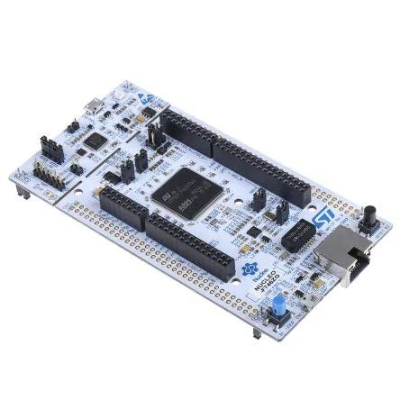

# Expandroid.Nucleo

<div align="center"></div>

[CATCHROBO](https://catchrobo.net/)でロボットを制御するためのNucleoボードのプロジェクト。

ラップトップPC<=>NucleoはEthernet(UDP)で通信し，Nucleo<=>ロボットはCANで通信，ラップトップとロボットを中継する役割を担う。

Nucleoボードとしては[Nucleo-144 STM32F767ZI](https://www.st.com/ja/evaluation-tools/nucleo-f767zi.html)を使用する。


## Installations for Linux


### STM32CubeMX

### toolchain

### [STLINK Tools](https://github.com/stlink-org/stlink)

```bash
sudo apt install stlink-tools
```

以下のコマンドで書き込みを行う。

```bash
st-flash write build/Expandroid.Nucleo.bin 0x8000000
```

### VSCodeでのデバッグ環境

## Configations

### Network

| Name         | Value           |
| ------------ | --------------- |
| NUCLEO IP    | 192.168.137.131 |
| PORT for LED |                 |

### User Button

```json
{
  "time": 1000,
}
```

### LED
